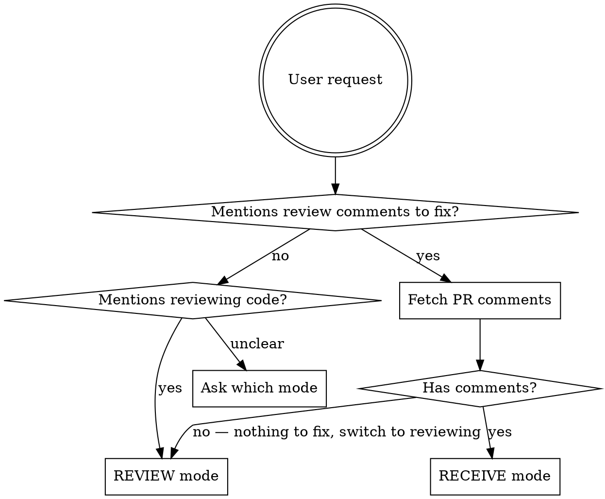

# PR Feedback

Interactive workflow for receiving and sending PR feedback through GitHub. Two modes: **receive** (address review comments) and **review** (send feedback on a PR).

**UI rule:** Whenever the workflow needs user input on a decision, use the **AskUserQuestion** tool to present options. Do not ask questions as plain text -- always use the tabbed selection UI.

## Mode Detection



When the user asks to address PR feedback but there are no review comments, there is nothing to receive. In this case, automatically switch to **Review Mode** -- inform the user that no comments were found and that you will review the PR changes instead.

## Receive Mode

Address review comments on a PR where the user (or their collaborator) is the author.

### Step 0: Choose workspace and check out branch

Before doing any work, ask the user how to set up the workspace. Use **AskUserQuestion**:

```
question: "How should I set up the workspace for this PR?"
header: "Workspace"
options:
  - label: "Current repo"
    description: "Work in the current git directory and check out the PR branch"
  - label: "Worktree"
    description: "Create a git worktree from the current repo for this branch"
  - label: "Clone fresh"
    description: "Clone the repo to a new location and check out the branch"
```

Get the PR's branch name first using `headRefName` from the PR metadata:

```bash
gh pr view {number} --repo {owner}/{repo} --json headRefName --jq .headRefName
```

Then handle the chosen strategy:

- **Current repo**: fetch and check out the branch in the current directory.
  ```bash
  git fetch origin {branch}
  git checkout {branch}
  ```
- **Worktree**: create a worktree for the branch in a sibling directory, then operate from there.
  ```bash
  git fetch origin {branch}
  git worktree add ../{repo}-{branch} {branch}
  ```
- **Clone fresh**: clone the repo under the XDG cache path at `parley/{pr-number}/{repo}` and check out the branch.
  ```bash
  CLONE_DIR="${XDG_CACHE_HOME:-$HOME/.cache}/parley/{number}/{repo}"
  mkdir -p "$(dirname "$CLONE_DIR")"
  gh repo clone {owner}/{repo} "$CLONE_DIR"
  # then in the new directory:
  git checkout {branch}
  ```
  Record the clone path so it can be offered for removal in Step 6.

If the checkout, worktree creation, or clone fails (e.g., due to uncommitted changes or a path conflict), stop and inform the user before proceeding. Never apply fixes to the wrong branch or location.

### Step 1: Fetch and parse

**Default: fetch only open (unresolved) review threads.** Resolved threads have already been handled and should not be re-addressed. Only fetch resolved threads if the user explicitly asks to revisit them (e.g., "include resolved comments", "look at already-resolved threads").

```bash
# Get PR metadata
gh pr view {number} --repo {owner}/{repo} --json title,body,url,state,headRefName

# Get the current user's login (used to detect self-authored comments)
gh api user --jq .login

# Get inline review threads with resolution status via GraphQL.
# The query returns all threads; filter client-side to keep only isResolved == false.
# Do NOT drop this filter unless the user explicitly asks to include resolved threads.
gh api graphql -F owner={owner} -F repo={repo} -F number={number} -f query='
  query($owner: String!, $repo: String!, $number: Int!) {
    repository(owner: $owner, name: $repo) {
      pullRequest(number: $number) {
        reviewThreads(first: 100) {
          nodes {
            id
            isResolved
            comments(first: 50) {
              nodes {
                databaseId
                author { login }
                body
                path
                line
                diffHunk
              }
            }
          }
        }
      }
    }
  }'

# Get top-level review bodies (summary text submitted with approve/request-changes/comment reviews)
gh api repos/{owner}/{repo}/pulls/{number}/reviews
```

Discard any thread where `isResolved` is `true` -- those are closed and out of scope by default. Record each remaining (open) thread's `id` alongside its comments so the thread can be resolved later if needed.

### Step 2: Present ALL comments

List **every** comment from unresolved threads, including ones that look informational, agreements, or praise. Do not silently skip any comment. Group by file. For each comment show:
- File path and line
- The diff hunk (from the comment's `diffHunk` field)
- The author login (so the user can see at a glance which comments are self-authored)
- The comment body
- Whether it's part of a thread (has replies)
- Suggested disposition (see below)

Dispositions:
- **fix** — code change needed; a reply will be drafted describing what changed
- **reply** — no code change; a reply acknowledges/discusses the point
- **skip** — no action, no reply
- **fix-and-resolve** — code change needed; **no reply**, resolve the thread after the fix lands. This is the default for comments whose author matches the current user's login.
- **resolve** — no code change, no reply, just resolve the thread. Use this for self-authored comments that only needed a note (no fix required).

Self-authored rule: for any comment where `author.login` equals the current user's login, default the disposition to **fix-and-resolve** (if a fix is needed) or **resolve** (if not). Do not reply to yourself by default. The user may still override to **reply** if they want an explicit note in the thread.

If any comment is unclear, flag it explicitly and ask the user to clarify its intent -- do not guess. Present the full list with suggested dispositions, then use **AskUserQuestion** to confirm:

```
question: "Are these dispositions correct, or would you like to change any?"
header: "Dispositions"
options:
  - label: "Looks good"
    description: "Proceed with the suggested dispositions as-is"
  - label: "I have changes"
    description: "I'll specify which comments to change"
```

Claude may suggest **skip** but only the user can finalize that disposition -- never skip a comment without explicit user approval.

### Step 3: Ask for execution mode

Use **AskUserQuestion** with three questions:

```
question: "How should I work through the comments?"
header: "Exec mode"
options:
  - label: "Autonomous"
    description: "Fix all, draft replies for all, show summary at end"
  - label: "One-by-one"
    description: "For each comment: fix, show draft reply, wait for approval"

question: "When should I submit replies?"
header: "Submission"
options:
  - label: "Immediately"
    description: "Submit each reply right after you approve it"
  - label: "Batch at end"
    description: "Hold all replies and submit them together after final review"

question: "Add an attribution marker so reviewers can tell replies came from an LLM?"
header: "Attribution"
options:
  - label: "Suffix '- claude'"
    description: "Append ' - claude' to each reply"
  - label: "Prefix 'from claude:'"
    description: "Prepend 'from claude: ' to each reply"
  - label: "None"
    description: "Send replies with no attribution marker"
```

The "Other" entry in the AskUserQuestion UI lets the user supply a custom marker (e.g., a different model name or an arbitrary tag). Treat any custom value as the literal marker text and apply it in the same position it implies: leading text → prefix, trailing text → suffix.

### Step 4: Implement all changes and draft all replies

Process each comment by disposition:
- **fix** — implement the fix (adopt the `superpowers:receiving-code-review` posture: verify the suggestion is correct before implementing, never blindly agree), then draft reply text (do NOT submit yet).
- **fix-and-resolve** — implement the fix as above, but do NOT draft a reply. Mark the thread to be resolved in Step 5 after the code is pushed.
- **reply** — no code change; draft reply text.
- **resolve** — no code change, no reply; mark the thread to be resolved in Step 5.
- **skip** — no action and no reply; included in the final summary only.

In **one-by-one** mode, show each fix/draft for approval before moving to the next. In **autonomous** mode, implement all fixes and draft all replies, then show a summary.

Apply the attribution marker chosen in Step 3 to every draft reply before showing or submitting it. Show the marker as part of each draft so the user sees the final text they're approving.

After all fixes are implemented, summarize what changed and ask the user how to push. Do not push automatically. Code must be pushed before any replies go out -- reviewers should see the updated code when they read the reply.

Use **AskUserQuestion** to ask the push method:

```
question: "How should I push the changes?"
header: "Push method"
options:
  - label: "git push"
    description: "Plain git push to the remote branch"
  - label: "gh"
    description: "Push via GitHub CLI"
  - label: "graphite-cli"
    description: "Push via Graphite (gt stack submit, etc.)"
  - label: "Push only"
    description: "Push the code but skip replies -- I'll handle comments myself"
  - label: "Skip everything"
    description: "Don't push or reply -- I'll handle it all myself"
```

If the user picks **Push only**, push the code using plain `git push` (or ask which method if unclear), then stop -- skip Steps 5 and 6 entirely. The user will handle replies on their own.

If the user picks **Skip everything**, stop after the summary -- skip pushing and reply submission. Warn the user that replies reference code changes that haven't been pushed yet, so they should push before replying.

### Step 5: Submit replies and resolve threads

Only after code changes are pushed (or if there are no code changes), submit replies and resolve threads:
- **fix** comments: reply describes what was changed and why
- **reply** comments: reply acknowledges, discusses, or answers the reviewer's point (no code change)
- **fix-and-resolve** comments: no reply is sent; resolve the thread
- **resolve** comments: no reply is sent; resolve the thread

In **autonomous** mode, show all draft replies for final approval before submitting. In **one-by-one** mode, replies were already approved individually in Step 4 -- submit them without re-asking (unless the user chose batch submission in Step 3).

```bash
# Post a reply in an existing thread
gh api repos/{owner}/{repo}/pulls/{number}/comments/{comment_id}/replies \
  -f body="reply text"

# Resolve a thread (use the thread id captured in Step 1)
gh api graphql -F threadId={threadId} -f query='
  mutation($threadId: ID!) {
    resolveReviewThread(input: {threadId: $threadId}) {
      thread { isResolved }
    }
  }'
```

Reply in the thread, never as a top-level PR comment. If the comment is a top-level review, reply on the review itself. Top-level review bodies do not belong to a thread and cannot be resolved -- for self-authored top-level reviews, default to **skip** unless the user wants to reply.

### Step 6: Wrap up

After all comments addressed: summarize what was fixed, what was replied to, what was skipped, and what needs follow-up.

If the user picked **Clone fresh** in Step 0, offer to remove the clone directory now that the work is done. Use **AskUserQuestion**:

```
question: "Remove the cloned repo at {clone_path}?"
header: "Cleanup"
options:
  - label: "Remove"
    description: "Delete the clone directory now that the work is done"
  - label: "Keep"
    description: "Leave the clone in place for further use"
```

Only remove the directory if the user picks **Remove**. Never delete a clone silently.

## Review Mode

Review a PR and submit feedback where the user controls what gets posted.

### Step 1: Fetch and understand

```bash
gh pr view {number} --repo {owner}/{repo} --json title,body,url,state,headRefName,files
gh pr diff {number} --repo {owner}/{repo}
```

**Check for a plan:** Read the PR body for an attached implementation plan, checklist, or linked planning document. If a plan exists, use it as the review baseline -- verify that the diff implements what the plan describes and flag deviations (missing steps, extra changes, or contradictions). If no plan exists, review the diff on its own merits.

For large PRs (>500 lines changed or >10 files), spawn parallel Explore agents to review different areas of the diff. For small PRs, review directly.

### Step 2: Compile issues

Build a numbered list of findings as raw notes (do NOT show this to the user yet — the quality gate in Step 2.5 may drop or reframe items):

```
1. [file.py:42] Description of issue
2. [file.py:87] Description of issue
3. [other.py:15] Description of issue
```

### Step 2.5: Quality gate

Before showing anything to the user, dispatch a **general-purpose sub-agent** to grade every drafted finding as **high-signal** or **nit**. Brief the agent like a critical reviewer; the goal is to filter out comments that aren't worth the author's time.

**High-signal**: a real correctness, design, security, or coupling concern the author probably didn't catch — the kind of feedback the reviewer would thank you for. Includes plan/spec deviations, doc/code drift that misleads readers, broken error paths, contracts that don't match docs, and ambiguity worth confirming.

**Nit**: cosmetic style preferences, redundant cleanups, naming bikeshed, anything the author can reasonably ignore without harm. When in doubt, grade as nit — better to under-post than to flood the PR.

Pass the agent the diff context for each finding (file path, line, draft body) and ask for a one-line rationale per item. Spawn the sub-agent so the grading happens with a fresh perspective and doesn't get coloured by the analysis that produced the drafts.

Bucket the findings into two groups based on the agent's grading. Then present them to the user with framing language that mirrors the user's own confidence:

- **High-signal (recommend posting):** "I think these are worth the author's attention — should I post them?"
- **Nit / cosmetic (default skip):** "These are lower-weight nits — call them out if you want, but I'd default to skipping. Want to include any?"

Show the agent's one-line rationale alongside each finding so the user understands why it landed where it did.

### Step 3: User decides what to submit

Ask about each bucket separately via **AskUserQuestion**, plus the attribution marker. The high-signal bucket defaults to posting; the nit bucket defaults to skipping. If a bucket is empty, omit its question.

```
question: "Post the high-signal findings ({list of numbers})?"
header: "High-signal"
options:
  - label: "Post all"
    description: "Submit every high-signal comment as drafted"
  - label: "Subset"
    description: "Pick specific findings by number (e.g. 1,3)"
  - label: "One-by-one"
    description: "Review each draft individually -- approve, edit, or skip"
  - label: "Skip all"
    description: "Don't post any high-signal comment"

question: "Include any of the nit findings ({list of numbers})?"
header: "Nits"
options:
  - label: "None (default)"
    description: "Skip all nit comments"
  - label: "Pick which"
    description: "I'll specify by number"
  - label: "Post all nits"
    description: "Submit every nit comment as drafted (rare)"

question: "Add an attribution marker so the author can tell comments came from an LLM?"
header: "Attribution"
options:
  - label: "Suffix '- claude'"
    description: "Append ' - claude' to each comment body"
  - label: "Prefix 'from claude:'"
    description: "Prepend 'from claude: ' to each comment body"
  - label: "None"
    description: "Submit comments with no attribution marker"
```

The "Other" entry in the AskUserQuestion UI lets the user supply a custom marker (e.g., a different model name or an arbitrary tag). Treat any custom value as the literal marker text and apply it in the same position it implies: leading text → prefix, trailing text → suffix.

### Step 4: Draft, approve, and submit

For each comment to submit, show the draft text to the user first. Never submit without approval.

Apply the attribution marker chosen in Step 3 to every draft comment before showing or submitting it. The marker should appear in the draft the user approves so what they see is what gets posted.

```bash
# For inline comments, create a review with --input to send structured JSON
echo '{"event":"COMMENT","body":"","comments":[{"path":"file.py","line":42,"body":"comment text"}]}' \
  | gh api repos/{owner}/{repo}/pulls/{number}/reviews --input -
```

## Tone Guidelines

All text written to GitHub (replies, review comments) must follow these rules:

| Instead of | Write |
|-----------|-------|
| "Why did you..." | "What is the reason for..." |
| "Are you sure..." | "Did we discuss this going like..." |
| "You should..." | "Would it make sense to..." |
| "You forgot..." | "I noticed ... is missing" |
| "This is wrong" | "This might not work because..." |
| "This doesn't make sense" | "Could you help me understand the intent here?" |
| Bare "why?" | "What was the motivation for this approach?" |

Principles:
- Friendly and constructive, assume good intent
- Frame as questions or observations, not commands
- Concise but not terse -- one sentence of context before the ask
- No sarcasm, no passive-aggressive phrasing
- No emoji unless the repo convention uses them

## Quick Reference

| Action | Command |
|--------|---------|
| View PR | `gh pr view {n} --repo {o}/{r} --json title,body,url,state` |
| Current user login | `gh api user --jq .login` |
| Read open review threads (GraphQL, default) | see Step 1 query; filter `isResolved == false` -- only fetch resolved threads if the user explicitly asks |
| Read reviews | `gh api repos/{o}/{r}/pulls/{n}/reviews` |
| Reply to thread | `gh api repos/{o}/{r}/pulls/{n}/comments/{id}/replies -f body="..."` |
| Resolve thread | `gh api graphql -F threadId={id} -f query='mutation($threadId: ID!) { resolveReviewThread(input: {threadId: $threadId}) { thread { isResolved } } }'` |
| Submit review | `gh api repos/{o}/{r}/pulls/{n}/reviews -f event=COMMENT -f body="..." -f comments='[...]'` |
| Top-level comment (Review mode only) | `gh pr comment {n} --repo {o}/{r} --body "..."` |
| View diff | `gh pr diff {n} --repo {o}/{r}` |

## Common Mistakes

| Mistake | Fix |
|---------|-----|
| Submitting replies without user approval | Always show draft first |
| Replying as top-level comment | Use comment thread reply endpoint |
| Resolving threads authored by others | Only resolve threads the user explicitly asks to resolve, or self-authored threads per the default rule |
| Replying to your own comments by default | For self-authored comments, default to **fix-and-resolve** / **resolve** -- do not reply unless the user overrides |
| Fetching and processing resolved threads | Filter `isResolved == true` out at the GraphQL step; never address a thread that is already resolved |
| Accusatory tone in replies | Use tone guidelines table above |
| Starting fixes before mode selection | Present comments (Step 2), then ask autonomous vs one-by-one (Step 3), then implement (Step 4) |
| Skipping informational/agreement comments | Present every comment; user decides final disposition |
| Flooding the PR with cosmetic nits in Review mode | Run the Step 2.5 quality gate; default-skip the nit bucket unless the user opts in |
| Skipping the Step 2.5 quality gate when generating review comments | Always run the sub-agent grading before showing drafts -- the user's bar is high-signal only by default |
| Guessing intent on ambiguous comments | Ask the user to clarify |
| Submitting replies before pushing code | Push code first, then submit replies -- reviewers should see updated code with the reply |
| Pushing code without confirmation | Ask user for confirmation before pushing; never push silently |
