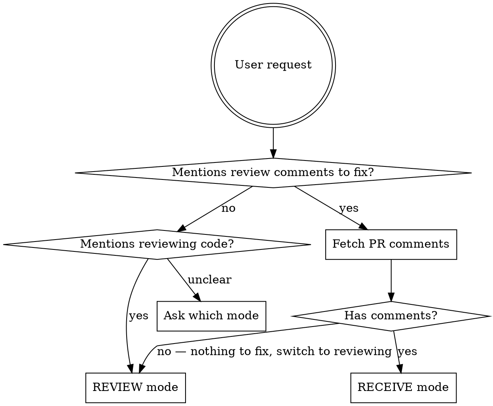

# PR Feedback

Interactive workflow for receiving and sending PR feedback through GitHub. Two modes: **receive** (address review comments) and **review** (send feedback on a PR).

**UI rule:** Whenever the workflow needs user input on a decision, use the **AskUserQuestion** tool to present options. Do not ask questions as plain text -- always use the tabbed selection UI.

## Mode Detection



When the user asks to address PR feedback but there are no review comments, there is nothing to receive. In this case, automatically switch to **Review Mode** -- inform the user that no comments were found and that you will review the PR changes instead.

## Receive Mode

Address review comments on a PR where the user (or their collaborator) is the author.

### Step 0: Verify branch is checked out

Before doing any work, ensure the PR's branch exists locally and is checked out. Use the `headRefName` from the PR metadata to determine the correct branch.

```bash
# Get the branch name from PR metadata
gh pr view {number} --repo {owner}/{repo} --json headRefName --jq .headRefName

# Check current branch
git branch --show-current

# If not on the correct branch, fetch and check it out
git fetch origin {branch}
git checkout {branch}
```

If the branch does not exist locally, fetch it from the remote. If the checkout fails (e.g., due to uncommitted changes), stop and inform the user before proceeding. Never apply fixes to the wrong branch.

### Step 1: Fetch and parse

```bash
# Get PR metadata
gh pr view {number} --repo {owner}/{repo} --json title,body,url,state,headRefName

# Get inline review comments (comments attached to specific lines of code)
gh api repos/{owner}/{repo}/pulls/{number}/comments

# Get top-level review bodies (summary text submitted with approve/request-changes/comment reviews)
gh api repos/{owner}/{repo}/pulls/{number}/reviews
```

### Step 2: Present ALL comments

List **every** comment, including ones that look informational, agreements, or praise. Do not silently skip any comment. Group by file. For each comment show:
- File path and line
- The diff hunk (from the comment's `diff_hunk` field)
- The reviewer's comment
- Whether it's part of a thread (has replies)
- Suggested disposition: **fix** (code change needed), **reply** (acknowledge/discuss, no code change), or **skip** (no action or reply needed)

If any comment is unclear, flag it explicitly and ask the user to clarify its intent -- do not guess. Present the full list with suggested dispositions, then use **AskUserQuestion** to confirm:

```
question: "Are these dispositions correct, or would you like to change any?"
header: "Dispositions"
options:
  - label: "Looks good"
    description: "Proceed with the suggested dispositions as-is"
  - label: "I have changes"
    description: "I'll specify which comments to change"
```

Claude may suggest **skip** but only the user can finalize that disposition -- never skip a comment without explicit user approval.

### Step 3: Ask for execution mode

Use **AskUserQuestion** with two questions:

```
question: "How should I work through the comments?"
header: "Exec mode"
options:
  - label: "Autonomous"
    description: "Fix all, draft replies for all, show summary at end"
  - label: "One-by-one"
    description: "For each comment: fix, show draft reply, wait for approval"

question: "When should I submit replies?"
header: "Submission"
options:
  - label: "Immediately"
    description: "Submit each reply right after you approve it"
  - label: "Batch at end"
    description: "Hold all replies and submit them together after final review"
```

### Step 4: Implement all changes and draft all replies

Process all comments with a **fix** disposition. For each:
1. Implement the fix (adopt the `superpowers:receiving-code-review` posture: verify the suggestion is correct before implementing, never blindly agree)
2. Draft the reply text (but do NOT submit it yet)

For comments with a **reply** disposition (no code change needed), draft reply text during this step as well.

Comments with a **skip** disposition need no action and no reply -- they are only included in the final summary.

In **one-by-one** mode, show each fix/draft for approval before moving to the next. In **autonomous** mode, implement all fixes and draft all replies, then show a summary.

After all fixes are implemented, summarize what changed and ask the user for confirmation before pushing. Do not push automatically. Code must be pushed before any replies go out -- reviewers should see the updated code when they read the reply.

### Step 5: Submit all replies

Only after code changes are pushed (or if there are no code changes), submit replies:
- **fix** comments: reply describes what was changed and why
- **reply** comments: reply acknowledges, discusses, or answers the reviewer's point (no code change)

In **autonomous** mode, show all draft replies for final approval before submitting. In **one-by-one** mode, replies were already approved individually in Step 4 -- submit them without re-asking (unless the user chose batch submission in Step 3).

```bash
gh api repos/{owner}/{repo}/pulls/{number}/comments/{comment_id}/replies \
  -f body="reply text"
```

Reply in the thread, never as a top-level PR comment. If the comment is a top-level review, reply on the review itself.

### Step 6: Wrap up

After all comments addressed: summarize what was fixed, what was replied to, what was skipped, and what needs follow-up.

## Review Mode

Review a PR and submit feedback where the user controls what gets posted.

### Step 1: Fetch and understand

```bash
gh pr view {number} --repo {owner}/{repo} --json title,body,url,state,headRefName,files
gh pr diff {number} --repo {owner}/{repo}
```

**Check for a plan:** Read the PR body for an attached implementation plan, checklist, or linked planning document. If a plan exists, use it as the review baseline -- verify that the diff implements what the plan describes and flag deviations (missing steps, extra changes, or contradictions). If no plan exists, review the diff on its own merits.

For large PRs (>500 lines changed or >10 files), spawn parallel Explore agents to review different areas of the diff. For small PRs, review directly.

### Step 2: Compile issues

Present a numbered list of findings to the user:

```
1. [file.py:42] Description of issue
2. [file.py:87] Description of issue
3. [other.py:15] Description of issue
```

### Step 3: User decides what to submit

Use **AskUserQuestion**:

```
question: "How would you like to submit these findings?"
header: "Submit mode"
options:
  - label: "All"
    description: "Show all draft comments for batch approval"
  - label: "Subset"
    description: "Pick specific findings by number (e.g. 1,3,5)"
  - label: "One-by-one"
    description: "Review each draft individually -- approve, edit, or skip"
```

### Step 4: Draft, approve, and submit

For each comment to submit, show the draft text to the user first. Never submit without approval.

```bash
# For inline comments, create a review with --input to send structured JSON
echo '{"event":"COMMENT","body":"","comments":[{"path":"file.py","line":42,"body":"comment text"}]}' \
  | gh api repos/{owner}/{repo}/pulls/{number}/reviews --input -
```

## Tone Guidelines

All text written to GitHub (replies, review comments) must follow these rules:

| Instead of | Write |
|-----------|-------|
| "Why did you..." | "What is the reason for..." |
| "Are you sure..." | "Did we discuss this going like..." |
| "You should..." | "Would it make sense to..." |
| "You forgot..." | "I noticed ... is missing" |
| "This is wrong" | "This might not work because..." |
| "This doesn't make sense" | "Could you help me understand the intent here?" |
| Bare "why?" | "What was the motivation for this approach?" |

Principles:
- Friendly and constructive, assume good intent
- Frame as questions or observations, not commands
- Concise but not terse -- one sentence of context before the ask
- No sarcasm, no passive-aggressive phrasing
- No emoji unless the repo convention uses them

## Quick Reference

| Action | Command |
|--------|---------|
| View PR | `gh pr view {n} --repo {o}/{r} --json title,body,url,state` |
| Read inline comments | `gh api repos/{o}/{r}/pulls/{n}/comments` |
| Read reviews | `gh api repos/{o}/{r}/pulls/{n}/reviews` |
| Reply to thread | `gh api repos/{o}/{r}/pulls/{n}/comments/{id}/replies -f body="..."` |
| Submit review | `gh api repos/{o}/{r}/pulls/{n}/reviews -f event=COMMENT -f body="..." -f comments='[...]'` |
| Top-level comment (Review mode only) | `gh pr comment {n} --repo {o}/{r} --body "..."` |
| View diff | `gh pr diff {n} --repo {o}/{r}` |

## Common Mistakes

| Mistake | Fix |
|---------|-----|
| Submitting replies without user approval | Always show draft first |
| Replying as top-level comment | Use comment thread reply endpoint |
| Marking threads as resolved | Never do this unless user explicitly says to |
| Accusatory tone in replies | Use tone guidelines table above |
| Starting fixes before mode selection | Present comments (Step 2), then ask autonomous vs one-by-one (Step 3), then implement (Step 4) |
| Skipping informational/agreement comments | Present every comment; user decides disposition (fix/reply/skip) |
| Guessing intent on ambiguous comments | Ask the user to clarify |
| Submitting replies before pushing code | Push code first, then submit replies -- reviewers should see updated code with the reply |
| Pushing code without confirmation | Ask user for confirmation before pushing; never push silently |
